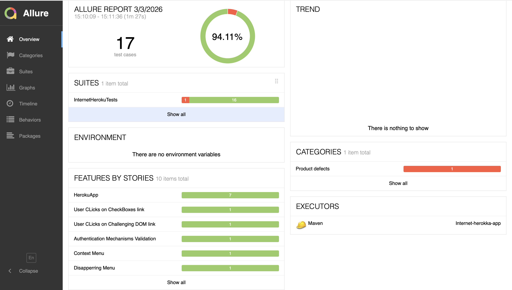

# Internet Heroku App – Selenium Test Automation Framework

This project is a **Selenium Test Automation Framework** built for the *Internet HerokuApp* website. It demonstrates clean automation design using **Java**, **TestNG**, **ThreadLocal WebDriver**, **Page Object Model (POM)**, **parallel execution**, and **cross‑browser testing**.

> **⚠️ Work in Progress**  
> This framework is actively being expanded. Additional modules from the HerokuApp site will be added over time, including more UI components, advanced interactions, and broader test coverage.

---

## 🚀 Features

### Parallel Execution  
Runs tests in parallel using TestNG’s `parallel="methods"` or `parallel="tests"` modes. ThreadLocal WebDriver ensures each thread gets its own browser instance.

### Cross‑Browser Support  
Supports:
- Chrome  
- Firefox  
- Edge  

Browser selection can be controlled via:
- TestNG XML  
- Maven command line  
- Optional default fallback

### Page Object Model (POM)  
Each page is represented as a dedicated class with clean locators, explicit waits, and reusable actions.

### Maven Profiles  
Two profiles allow switching between execution modes:

| Profile | Description |
|--------|-------------|
| `parallel` | Runs tests in parallel using `testng-parallel.xml` |
| `crossbrowser` | Runs Chrome, Firefox, and Edge simultaneously using `testng-crossbrowser.xml` |

---

## 📁 Project Structure

```
src
 └── test
      ├── java
      │    ├── base
      │    ├── pages
      │    └── alerts
      └── resources
           ├── testng-parallel.xml
           └── testng-crossbrowser.xml
```

---

## 🧪 Running Tests

### Run Parallel Tests (Chrome only)

```
mvn clean test -Pparallel
```

### Run Cross‑Browser Tests

```
mvn clean test -Pcrossbrowser
```

### Override Browser from Command Line

```
mvn clean test -Dbrowser=firefox
```

---

## 🧰 Dependencies

- Java 23  
- Selenium 4.38.0  
- TestNG 7.10.2  
- Maven Surefire Plugin  

All dependencies are defined in `pom.xml`.

---

## 🧭 Running Tests in IntelliJ

You can still run tests normally:

- Right‑click a test class → Run  
- Right‑click a package → Run  
- Right‑click `testng-parallel.xml` → Run parallel suite  
- Right‑click `testng-crossbrowser.xml` → Run cross‑browser suite  

If you run without XML, IntelliJ defaults to Chrome via `@Optional("chrome")`.

---
## Parallel Test Execution (TestNG + Threading)
 This screenshot shows the parallel execution of 5 tests using `parallel="methods"` and `thread-count="5"`.

----
## 📌 Future Enhancements

- Add more HerokuApp modules (Dropdowns, Frames, Dynamic Loading, etc.)  
- Add reporting (Allure or Extent)  
- Add logging (SLF4J + Logback)  
- Add CI pipeline (GitHub Actions or Jenkins)  
- Add Dockerized Selenium Grid  

---

